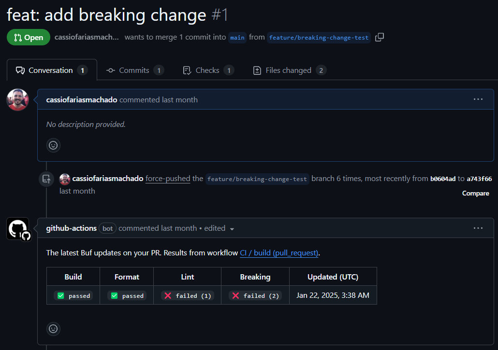
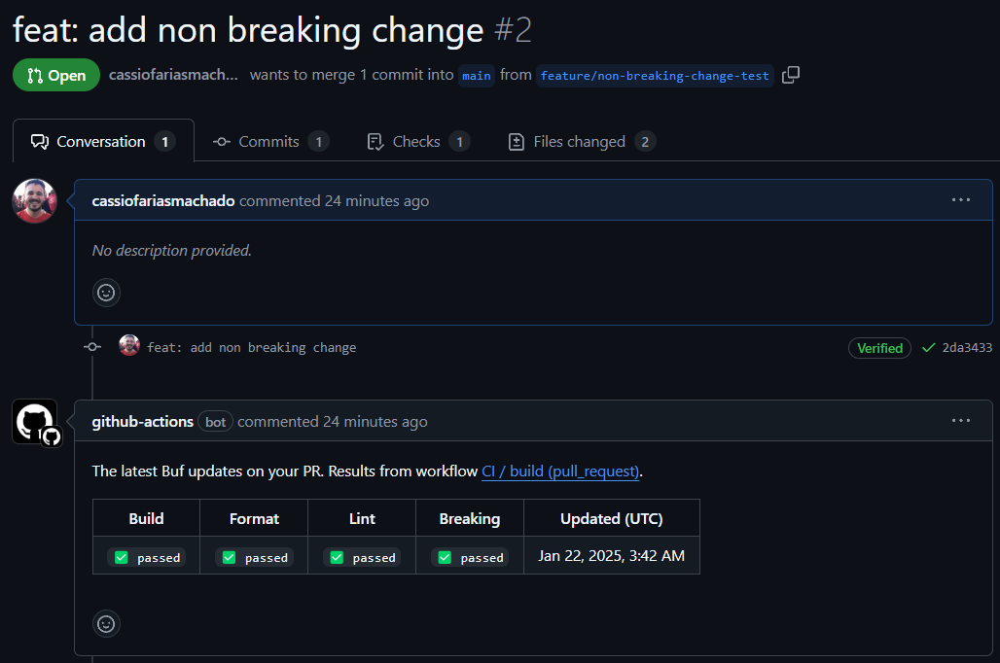

# Protobuf Breaking Change Validator

Proof of concept of automated breaking change validation on protobuf schemas.

Stack used:
- Node/NPM
- GitHub Actions
- Buf CLI

## Buf Configuration

The Buf CLI configuration can be found on [buf.yml](buf.yml) file.

For this experiment, a simple configuration was used with the `WIRE` option for breaking change validation and `STANDARD` (Buf's default) for lint, as shown below:

```yml
version: v2

breaking:
  use:
    - WIRE

linting:
  use:
    - STANDARD
```

> ℹ️ The `WIRE` configuration was chosen because it only detects changes that break wire (binary) encoding, ignoring other validations like renaming fields, which is acceptable in the context of binary encoding.

## Examples

### Pull Request with Breaking Changes



PR link: [#1](https://github.com/cassiofariasmachado/protobuf-breaking-change-validator/pull/1)

### Pull Request with Non-Breaking Changes



PR link: [#2](https://github.com/cassiofariasmachado/protobuf-breaking-change-validator/pull/2)
